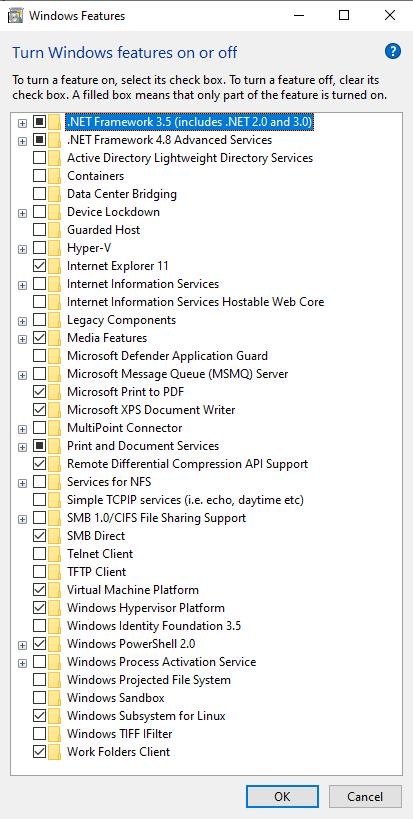
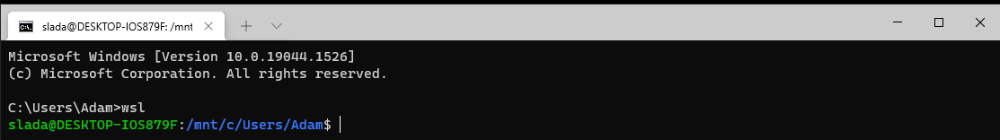
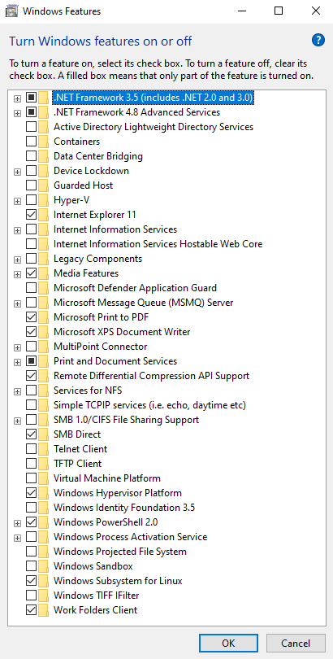
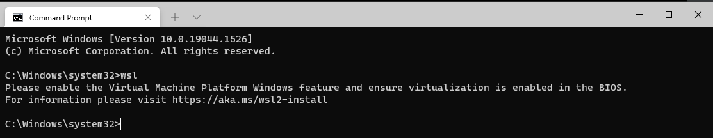
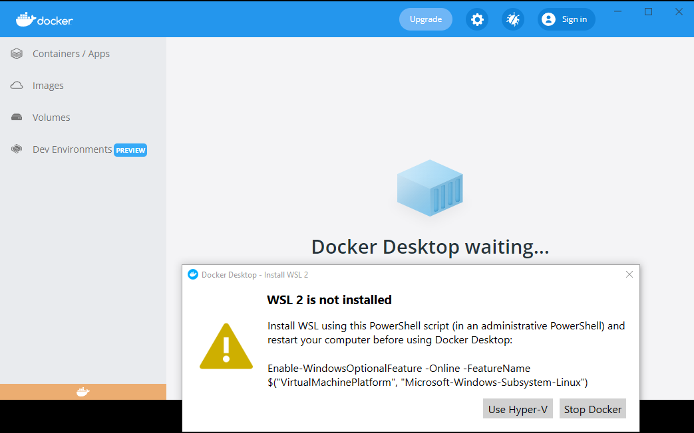

# Docker Desktop <--> VirtualBox switcher

A set of batch scripts (for Windows) to switch between Docker desktop and VirtualBox.

Assuming you have WSL 2, Docker Desktop and VirtualBox installed.

## switchToDockerDesktop.bat
- Asks for elevated privileges
- Disables Hyper-V
- Enables Virtual Machine platform
- Reboots the computer

### After running the script:
- WSL 2 will work

- Docker Desktop will work

- VirtualBox will work (very slowly) without hardware acceleration (green turtle)

## switchToVirtualBox.bat
- Asks for elevated privileges
- Disables Hyper-V
- Disables Virtual Machine platform
- Reboots the computer

### After running the script:

- WSL 2 will not work

- Docker Desktop will not work

- VirtualBox will work with hardware acceleration (Blue V logo)

